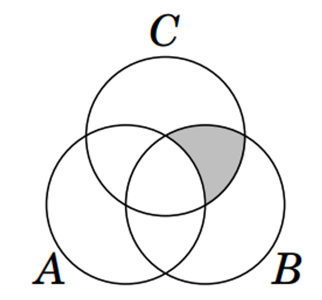
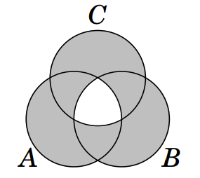
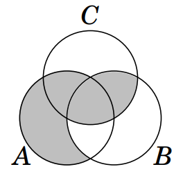

## Задание 0

## Задание 1

## Задание 2

Известно, что $y \in A\cup B$. Верно ли, что $y \in A$?

## Задание 3

Даны множества $A = \(\{x |\ x^2 - 7x + 6 = 0\}\), B = \{1,\ 6\}$.

Верно ли, что $A = B$?

## Задание 4

Доказать, что для любых $a, b, c, d$ верно $$\{a, \{a,b\}\} = \{c,\{c,d\}\} \implies a = c,\ b = d$$

## Задание 5

Определите истинность утверждений. 
1) $a \in \{\{a\}, b\}$
2) $a \in \{a, b\}$
3) $\{a\} \subset {a,b}$
4) $\{\{a\},\ b\} \subset \{\{a\},\ b\}$
5) $\{\{a\},\ b\} \subseteq \{a, \{b\}, \{a,b\}\}$

## Задание 6

Даны множества $U = \{x\ |\ x \in Z, -5≤ x ≤ 7\}, A = \{x\ | x \text{ — четное}\}, B = \{x\ |\ x \text{ — положительное}\}, C = \{2,-3,4,7\}$

Нарисуйте диаграмму Венна для заданных множеств,
отметьте на ней все элементы и найдите:

1) $A \cap B$ 
2) $B \cup C \cap A$
3) $\overline{C}$
4) $\overline{A\cup B}$
5) $\overline{U}$
6) $A \cup B \cup C$

## Задание 7

Определите $P(A)$, если 
1) $A = \{\varnothing, \{\varnothing, 1\}\}$
2) $A = \{x\ |\ x\in N, 2 ≤ x ≤ 6\}\ \cap \{y\ |\ y \in Z,\ -3 ≤ y ≤3\}$
3) $A = \{a,b,\{c,\{d\}\}\}$

## Задание 8
Найдите мощность булеана множества $A = \{x\ |Q(x)=0\}$, где $Q(x) = x^2 + 2x + 5$, $x \in \mathbb{C}$

## Задание 9

Задайте множество аналитически по закрашенной области диаграмм Эйлера-Венна:

1) 
2) 
3) 
 
Упростите полученные выражения

## Задание 10

## Задание 11
Доказать следующие утверждения:

1) $A \subseteq A$
2) $A \subseteq B \text{ и } B\subseteq C \implies A\subseteq C$
3) $A \cap B \subseteq A \subseteq A \cup B$ 
4) $A \cap B \subseteq B \subseteq A \cup B$
5) $A\backslash{B} \subseteq A$

## Задание 12

Доказать, что $$\forall A_1,A_2,...,A_n\  |\ A_1\subseteq A_2 \subseteq A_3\subseteq ... \subseteq A_n \subseteq A_1 \implies \ A_1 = A_2 = A_3=...=A_n$$

## Задание 13

Опишите словами, а также запишите перечислением данное множество:

$A = \{x | y={\frac{2}{x}\ \text{и}\ y = 5x-9}\}$
